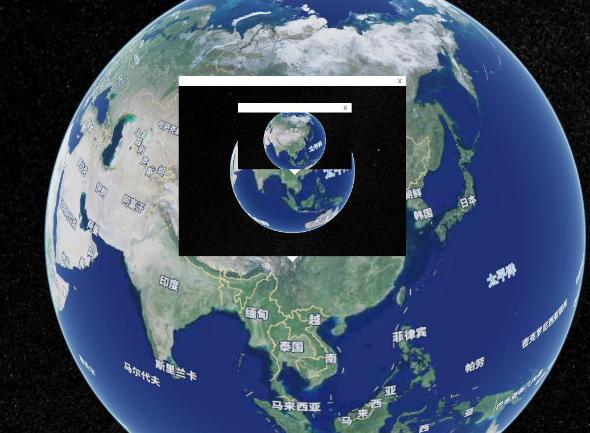

# 1.安装

```js
npm i cesium-popup
```

# 2.使用

在 main.js 或者 main.ts 中导入样式

```js
// 根据安装后的相对路径为准，这里只是演示
import "/src/Popup.css";
```

基本使用

```js
// 气泡
const popup = new Popup({
  // 气泡背景色
  bgColor: "white",

  // 气泡定位，如果不写自适应，有"bottom","top","left","right"四种定位
  anchor: "bottom",

  // 气泡添加的类名,可以自定义样式
  className: "popup-test",

  // 是否显示关闭按钮
  closeButton: true,

  // 气泡的偏移值，offset[0]为横向偏移值，offset[1]为纵向偏移值
  offset: [0, 0],
});

// 地图
const map = new Cesium.Viewer("mapContainer");

// 设置HTML
popup.setHTML("<div>hello,world</div>").setLngLat([lng, lat]).addTo(map);

// 或者设置dom元素
const el = document.getElementById("test");
popup.setDOMContent(el).setLngLat([lng, lat]).addTo(map);
```

事件监听

```js
// 气泡
const popup = new Popup();

// 气泡打开事件
popup.on("open", () => {
  console.log("do something");
});

// 气泡关闭事件
popup.on("close", () => {
  console.log("do something");
});
```

效果图片

更多参数设置请看 **'./demo/index.html'** 演示
